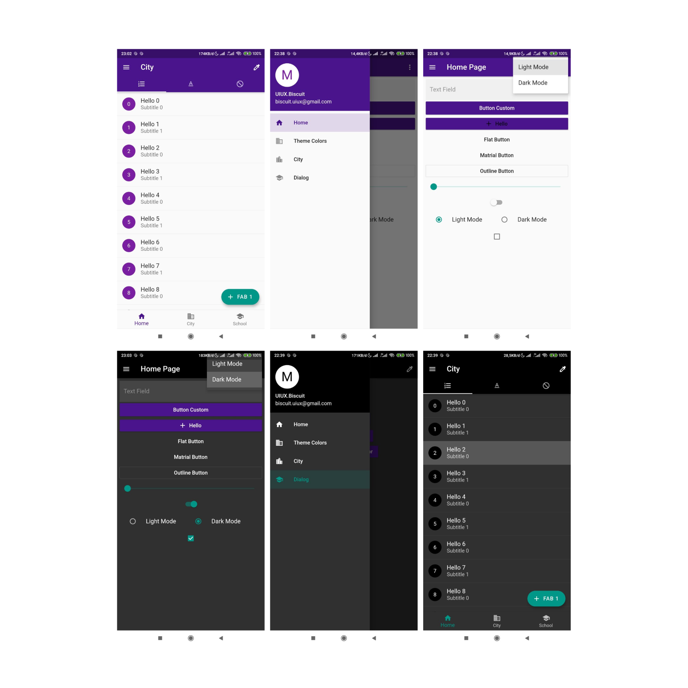

# Dynamic Theme for Flutter (Android and IOS) ([DEMO](https://github.com/Nanangprasetya/portofolio_flutter.git))

This application allows to set light or dark themes manually and also allows you to set a theme based on the system.


## Initialization

For help getting started with Flutter, view our online
[documentation](https://flutter.io/).


**Set Theme Data**

Change each theme to my liking.

```dart
 //Light Theme
 static ThemeData lightThemeData = ThemeData(
    brightness: Brightness.light,
    primaryColor: _primary,
    accentColor: _secondary,
    ...
    ...
 );

 //Dark Theme
  static ThemeData darkThemeData = ThemeData(
    brightness: Brightness.dark,
    primaryColor: _primeryDark,
    accentColor: _secondary,
    ...
    ...
  );
```

**Get Theme**

Calls `getThemeMode()` to call the current theme.

```dart
Future<void> main() async {
  WidgetsFlutterBinding.ensureInitialized();
  final saveThemeMode = await AdaptiveTheme.getThemeMode();
  runApp(MyApp(adaptiveTheme: saveThemeMode));
}
```

**Add AdaptiveTheme Widget**

Using this Plugin [Adaptive Theme](https://pub.dev/packages/adaptive_theme) really helped me.

```dart
class MyApp extends StatelessWidget {
  final AdaptiveThemeMode adaptiveTheme;

  const MyApp({Key key, this.adaptiveTheme}) : super(key: key);
  @override
  Widget build(BuildContext context) {
    return AdaptiveTheme(
      light: ThemeUtil.lightThemeData,
      dark: ThemeUtil.darkThemeData,
      initial: adaptiveTheme ?? AdaptiveThemeMode.light,
      builder: (theme, darktheme) {
        return MaterialApp(
          title: 'Flutter Demo',
          debugShowCheckedModeBanner: false,
          theme: theme,
          darkTheme: darktheme,
          home: HomePage(),
          onGenerateRoute: (RouteSettings settings) {
            ....
            ....
```

**Change Theme**

Changing the theme by calling the `toggleThemeMode()`, is very easy, right?

```dart
Switch(
  value: !AdaptiveTheme.of(context).isDefault,
  onChanged: (i) {
    AdaptiveTheme.of(context).toggleThemeMode();
  },
),
```

## Features :

* Dynamic Chenge Theme
* Toggle and PopupMenu for change Theme
* Color Theme Custom extend from Matrial Design
* List Item + Selected
* Text Theme
* Color ThemeData

### Folder **Structure**
Here is the core folder structure which Flutter Project.

```
lib/
|- Page/
    |- home
    |- city
    |- dialog
    |- theme_color_page
    |- not_found
|- Util/
    |- custom_route_util
    |- theme_util
|- Widget/
    |- drawer_widget
|- main
```

### Plugins

* [Adaptive Theme](https://pub.dev/packages/adaptive_theme)

### Social Media

* [Telegram Biscuit People](https://t.me/@Biscuit_People)
* [Instagram Biscuit People](https://www.instagram.com/uiux.biscuit/)
* [Dribbble Biscuit People](https://dribbble.com/biscuit_uiux)