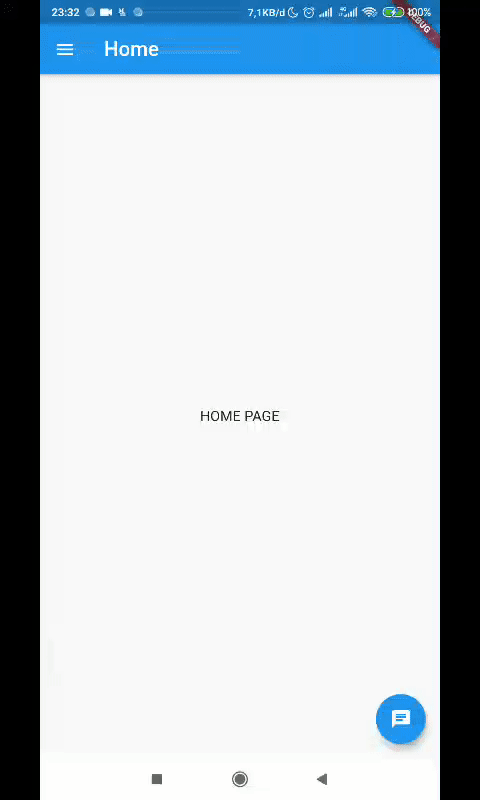

# Drawer or Side Bar for Flutter (Android and IOS) ([DEMO](https://github.com/Nanangprasetya/portofolio_flutter.git))

The application drawer can return when it is outside the home page then return to the first page without stopping the application and can handle double back to close the app.


## Initialization

For help getting started with Flutter, view our online
[documentation](https://flutter.io/).


**Widget List**

Use the `selected Index` for the selected Page also to specify the home page. `_onMenuTap ()` is used to call a new page.

```dart
Widget buildListTile(
    BuildContext context, {
    @required int selectedIndex,
    @required Widget lending,
    @required String title,
  }) {
    return Container(
      color: _selectedIndex == selectedIndex
          ? Theme.of(context).primaryColor.withOpacity(0.15)
          : null,
      child: ListTile(
        selected:_selectedIndex == selectedIndex,
        leading: lending,
        title: Text(title),
        onTap: () => _onMenuTap(context, selectedIndex),
      ),
    );
  }

```
**OnTab**

Function for processing page displacement.

```dart
void _onMenuTap(BuildContext context, int index) {
    Navigator.pop(context);
    if (index == _selectedIndex) return;

    if (index == 0) {
      Navigator.pop(context);
    } else if (index == 1) {
      if (_selectedIndex == 0) {
        Navigator.pushNamed(context, '/country');
      } else {
        Navigator.pushReplacementNamed(context, '/country');
      }
    } else if (index == 2) {
      if (_selectedIndex == 0) {
        Navigator.pushNamed(context, '/city');
      } else {
        Navigator.pushReplacementNamed(context, '/city');
      }
    }
  }

```
**Call Drawer Widget**

`DrawerWidget ()` requires the ʻint` parameter to specify the location of this page.

```dart
return Scaffold(
      drawer: DrawerWidget(0),
      appBar: AppBar(
        title: Text("Home"),
      ),
      .......
```

**Generate Route**

Using this `onGenerateRoute` helps me in overcoming page errors. This `CustomRouteUtil` is used to make a transition animation when the page changes.

```dart
onGenerateRoute: (RouteSettings settings) {
        switch (settings.name) {
          case '/home':
            return CustomRouteUtil(
              builder: (context) => HomePage(),
            );
          case '/country':
            return CustomRouteUtil(
              builder: (context) => CountryPage(),

            );
    .......
```

**CustomRouteUtil**

This function is used to make the page turn annoying, because I use `Navigator.pushReplacementNamed ()` to change the page.

```dart
import 'package:flutter/material.dart';

class CustomRouteUtil<T> extends MaterialPageRoute<T> {
  CustomRouteUtil({WidgetBuilder builder, RouteSettings settings})
      : super(builder: builder, settings: settings);

  @override
  Widget buildTransitions(BuildContext context, Animation<double> animation,
      Animation<double> secondaryAnimation, Widget child) {

    // Settings.name digunakan jika tidak menginginkan Transition
    if (settings.name != null)
    return child;
    return new FadeTransition(opacity: animation, child: child);
  }
```


## Features :

* Selected Indicator List Drawer
* Handle Back Page
* Chenge Page 1 Tab
* Double back snackbar
* Animation Route

### Folder Structure
Here is the core folder structure which Flutter Project.

```
lib/
|- Page/
    |- home
    |- city
    |- country
    |- not_found
|- Util/
    |- custom_route_util
|- Widget/
    |- drawer_widget
|- main
```

### Plugins

* [Double Back to close App](https://pub.dev/packages/double_back_to_close_app)

### Social Media

* [Telegram Biscuit People](https://t.me/@biscuit_uiux)
* [Instagram Biscuit People](https://www.instagram.com/biscuit_uiux/)
* [Dribbble Biscuit People](https://dribbble.com/biscuit_uiux)